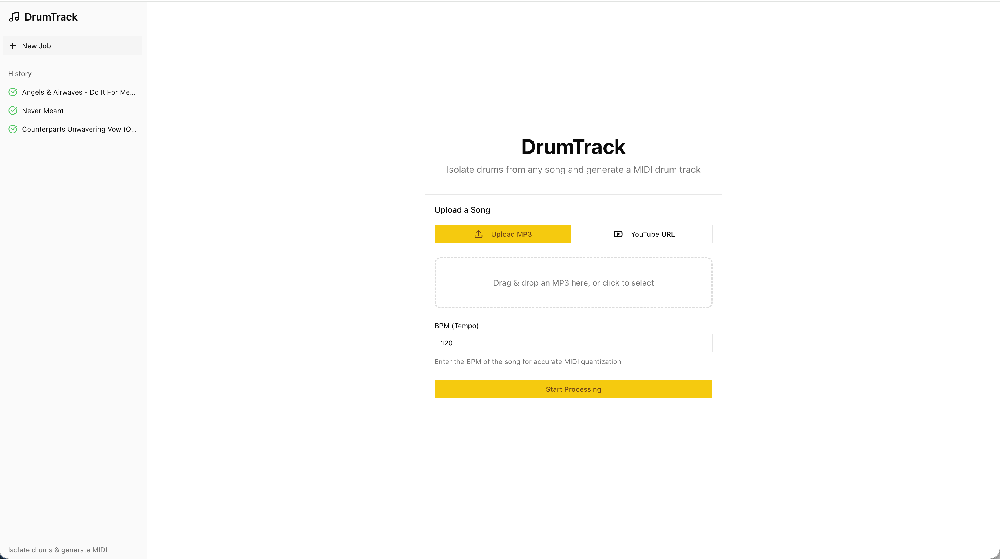
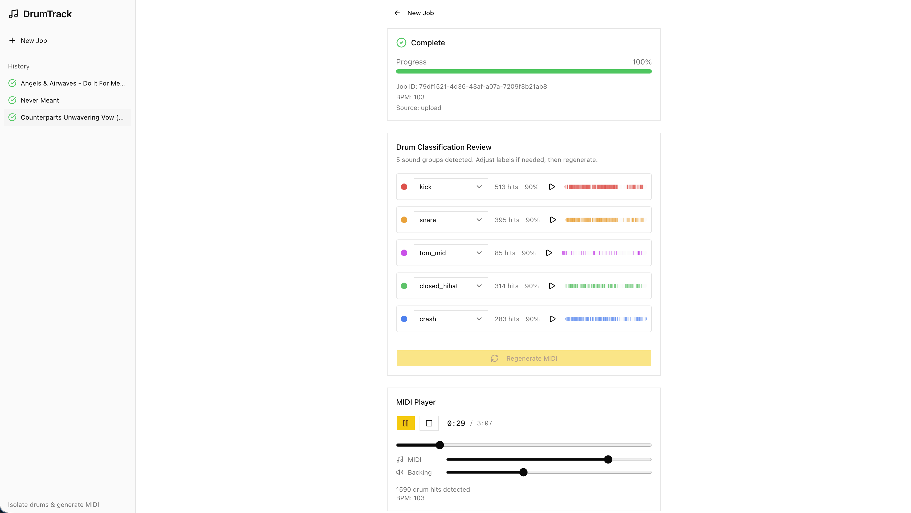

# DrumTrack

Isolate drums from any song and generate a playable MIDI drum track.

Upload an MP3 or paste a YouTube URL, and DrumTrack will separate the drums, detect individual hits, and produce a MIDI file you can drag into your DAW. You can review the detected drum types, relabel them, and regenerate the MIDI before downloading.

## How It Works

DrumTrack processes audio through a multi-stage pipeline that combines deep learning models with signal processing.

## Screenshots

| Scenario | Screenshot |
| --- | --- |
| Upload a song or Youtube link |  |
| Get song output |  |

## Examples
| Input | Output (drums are midi) |
| --- | --- |
| [Neat - I remember](https://www.youtube.com/watch?v=LmAHa_oJdA4) | [neat-i-remember-midi-drums.wav](https://github.com/user-attachments/files/25243372/neat-i-remember-midi-drums.wav) |

### Pipeline Overview

```
Audio Input (MP3 upload or YouTube URL)
    |
    v
1. Stem Separation (Demucs)
   Isolates drums from bass, vocals, and other instruments
    |
    v
2. Drum Instrument Separation (DrumSep MDX23C)
   Splits the drum stem into 5 individual instruments:
   kick, snare, toms, hi-hat, cymbals
    |
    v
3. Onset Detection (librosa)
   Finds the precise time and velocity of each drum hit
    |
    v
4. Quantization & MIDI Generation (pretty_midi)
   Snaps hits to a musical grid and writes a MIDI file
    |
    v
5. Interactive Review
   Listen back, relabel misclassified hits, re-export
```

#### References
<https://github.com/adefossez/demucs>
<https://docs.google.com/document/d/17fjNvJzj8ZGSer7c7OFe_CNfUKbAxEh_OBv94ZdRG5c/edit?tab=t.0>
<https://github.com/ZFTurbo/Music-Source-Separation-Training/tree/main>

### Stem Separation

The first step isolates the drum track from the rest of the mix using **Demucs** — Facebook Research's `htdemucs` model, a hybrid transformer/waveform U-Net that separates audio into four stems (drums, bass, vocals, other). Runs locally on CPU or GPU.

The non-drum stems are mixed back together into a "backing track" that can be played alongside the MIDI output for reference.

Audio hashing (SHA-256) enables deduplication: if you process the same audio twice, stems from the first run are reused.

### Drum Instrument Separation

The isolated drum stem is further separated into five individual instruments using **DrumSep**, an MDX23C model (TFC-TDF-net architecture). The model operates in the frequency domain:

1. **STFT** converts the waveform to a spectrogram (16384-point FFT, 2048 hop)
2. An **encoder-decoder** network with TFC-TDF blocks (temporal-frequency convolutions + time-domain filter bottlenecks) predicts five instrument masks
3. Each mask is applied to the input spectrogram and inverse-STFT'd back to audio

The five output stems are: **kick**, **snare**, **toms**, **hi-hat**, and **cymbals**. Model weights (~200MB) are downloaded automatically on first run.

### Onset Detection

Each drum stem is analyzed independently using librosa's onset detection, with per-instrument parameters tuned for different hit characteristics:

| Stem | Threshold (delta) | Min Wait (frames) |
|------|-------------------|--------------------|
| Kick | 0.08 | 3 |
| Snare | 0.06 | 2 |
| Toms | 0.07 | 3 |
| Hi-hat | 0.05 | 1 |
| Cymbals | 0.06 | 4 |

**Velocity estimation** measures RMS amplitude in a 50ms window around each onset, converts to dB, and maps to MIDI velocity (0-127) on a logarithmic scale. Quiet hits (~-60 dB) map to velocity 20; loud hits (~0 dB) map to 127.

**Deduplication** removes double-triggers using type-specific minimum gaps (kick: 35ms, snare: 40ms, hi-hat: 25ms, cymbals: 150ms). When two hits fall within the gap, the louder one is kept.

### Quantization

Detected hit times are snapped to a 16th-note grid based on the user-provided BPM:

```
grid_step = 60 / BPM / 4
grid_position = round(time / grid_step)
quantized_time = grid_position * grid_step
```

A 30% tolerance preserves swing feel: if a hit deviates from the grid by more than 30% of a grid step, its original timing is kept. This prevents the MIDI from sounding overly mechanical on tracks with intentional swing.

### MIDI Generation

Quantized events are written to a Standard MIDI File using `pretty_midi`:

- All notes are on MIDI channel 10 (General MIDI drum channel)
- Each hit becomes a 50ms note at the appropriate MIDI note number (e.g., kick=36, snare=38, hi-hat=42)
- Velocity values from the onset detection stage are preserved

### Interactive Review

The web UI allows you to review the automatic classification before downloading. Each detected cluster of hits can be relabeled (e.g., changing a misidentified tom to a snare), and the MIDI is regenerated on the fly. A built-in player syncs the MIDI playback with the backing track so you can hear exactly what the output sounds like.

## Architecture

```
drumtrack/
  app/                    # Next.js app router (pages)
  components/             # React components (shadcn/ui)
  hooks/                  # React hooks (polling, MIDI player)
  lib/                    # API client, MIDI playback engine
  types/                  # TypeScript type definitions
  public/samples/         # Synthesized drum WAV samples for playback
  backend/
    app/
      routers/            # FastAPI endpoints
      services/           # Processing pipeline, ML models
      models/             # Pydantic data models
      storage/            # Job persistence, file management
      ml/                 # MDX23C neural network definition
    models/               # Downloaded model weights (gitignored)
    storage/jobs/         # Job artifacts per UUID (gitignored)
```

- **Frontend**: Next.js 16, React 19, Tailwind CSS 4, shadcn/ui, Tone.js
- **Backend**: FastAPI, PyTorch, Demucs, librosa, pretty_midi

## Local Setup

### Prerequisites

- **Node.js** 18+ and [**pnpm**](https://pnpm.io/)
- **Python** 3.11+ and [**uv**](https://docs.astral.sh/uv/)
- **ffmpeg** (required by Demucs and yt-dlp for audio conversion)
- **yt-dlp** (optional, for YouTube URL support)

### Backend

```bash
cd backend
uv sync
```

This installs all Python dependencies including PyTorch, Demucs, librosa, and FastAPI. On first run, the DrumSep model weights (~200MB) will be downloaded automatically.

Start the backend:

```bash
cd backend
uv run uvicorn app.main:app --reload
```

The API will be available at `http://localhost:8000`. Interactive API docs at `http://localhost:8000/docs`.

### Frontend

```bash
pnpm install
pnpm dev
```

The frontend will be available at `http://localhost:3000`.

By default it connects to the backend at `http://localhost:8000`. To change this, set the `NEXT_PUBLIC_API_URL` environment variable.

## Usage

1. Open `http://localhost:3000`
2. Upload an MP3 file (or paste a YouTube URL) and enter the song's BPM
3. Click **Start Processing** and watch the progress bar
4. Once complete, review the detected drum hits in the cluster review panel
5. Use the built-in player to listen to the MIDI drums synced with the backing track
6. Relabel any misclassified hits and click **Regenerate MIDI** if needed
7. Download the MIDI file, individual drum stems, backing track, or full drum track

The sidebar shows all previous jobs. Jobs persist across server restarts.

## API

| Method | Path | Description |
|--------|------|-------------|
| `POST` | `/api/jobs/upload` | Upload MP3 + BPM, start processing |
| `POST` | `/api/jobs/youtube` | Submit YouTube URL + BPM |
| `GET` | `/api/jobs/` | List all jobs (newest first) |
| `GET` | `/api/jobs/{id}` | Get job status and progress |
| `GET` | `/api/jobs/{id}/midi` | Download MIDI file |
| `GET` | `/api/jobs/{id}/drum-track` | Download isolated drum track (MP3) |
| `GET` | `/api/jobs/{id}/other-track` | Download backing track (MP3) |
| `GET` | `/api/jobs/{id}/stems/{name}` | Download individual drum stem (WAV) |
| `GET` | `/api/jobs/{id}/events` | Get drum events as JSON |
| `GET` | `/api/jobs/{id}/clusters` | Get clusters and events |
| `PUT` | `/api/jobs/{id}/clusters` | Update cluster labels, regenerate MIDI |

Stem names: `kick`, `snare`, `toms`, `hh`, `cymbals`.
